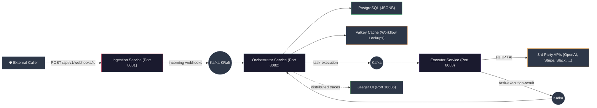

<h1 align="center">Zync</h1>
<h3 align="center"><em>A Distributed, Event-Driven Workflow Automation Engine</em></h3>

---

Zync is a self-hosted workflow automation engine — three microservices connected by Apache Kafka that ingest webhooks, orchestrate multi-step pipelines, and execute actions against third-party APIs. It solves schemaless state passing through unpredictable JSON payloads, distributed execution state management, and resilient integration with external services. The entire system runs on **Java 21 Virtual Threads**, making it trivially scalable for I/O-bound workloads without thread-pool tuning.

Each step's output accumulates into a JSON tree, and downstream steps reference previous results via `{{$.step_N.field}}` — resolved at runtime by Jayway JsonPath. PostgreSQL JSONB columns store arbitrarily-shaped data without schema migrations, Valkey caches workflow lookups, and OpenTelemetry traces every message from webhook arrival to final step execution.

---

## Architecture



---

## Features

- **Variable passing** — `{{$.step_1.field}}` references any previous step's output, resolved via JsonPath
- **Plugin architecture** — implement `AppActionAdapter` to add new action types (HTTP, AI, Log included)
- **Resilient HTTP calls** — Resilience4j retry with exponential backoff (3 attempts, 2x multiplier)
- **End-to-end tracing** — OpenTelemetry at 100% sampling across all services, viewable in Jaeger
- **Virtual Threads** — Java 21 Virtual Threads on orchestrator and executor for high I/O concurrency
- **Cache-augmented lookups** — Workflow definitions cached in Valkey with 1-hour TTL
- **Schema-free storage** — PostgreSQL `jsonb` columns store arbitrary configs and payloads
- **KRaft Kafka** — no ZooKeeper dependency

---

## Quick Start

```bash
git clone https://github.com/PANKAJ2003/Zync.git && cd zync
docker compose up -d --build
```

| Service | Port | Purpose |
|---|---|---|
| ingestion-service | 8081 | Webhook HTTP endpoint |
| orchestrator-service | 8082 | Workflow CRUD + execution orchestration |
| executor-service | 8083 | Action execution (HTTP, AI, Log) |
| postgres | 5432 | Workflow state |
| valkey | 6379 | Workflow cache |
| kafka | 9092 | Message broker (KRaft) |
| jaeger | 16686 | Distributed tracing UI |

```bash
curl -s http://localhost:8081/api/v1/health    # → OK
```

---

## Configuration

Create a `.env` file in the project root to override defaults:

```bash
# Infrastructure
KAFKA_BOOTSTRAP_SERVERS=localhost:9092
OTLP_ENDPOINT=http://localhost:4318/v1/traces

# PostgreSQL (orchestrator-service)
DATABASE_URL=jdbc:postgresql://localhost:5432/workflow_db
DATABASE_USER=admin
DATABASE_PASSWORD=password

# Valkey cache (orchestrator-service)
VALKEY_HOST=localhost
VALKEY_PORT=6379

# AI provider (executor-service)
OPENAI_API_KEY=sk-...
OPENAI_BASE_URL=https://api.openai.com/v1
AI_MODEL=gpt-4o
```

All values have sensible defaults — only `OPENAI_API_KEY` and `OPENAI_BASE_URL` are required for AI steps.

---

## Usage

Create a 2-step workflow (AI generates text, then POSTs it):

```json
POST http://localhost:8082/api/v1/workflows
Content-Type: application/json

{
  "name": "AI Content Publisher",
  "steps": [
    {
      "stepOrder": 1,
      "actionType": "AI_PROMPT",
      "config": {
        "prompt": "Write a tweet about {{$.topic}}. Max 280 chars."
      }
    },
    {
      "stepOrder": 2,
      "actionType": "HTTP_REQUEST",
      "config": {
        "url": "https://hooks.example.com/publish",
        "method": "POST",
        "body": "{ \"content\": \"{{$.step_1.ai_generated_text}}\" }"
      }
    }
  ]
}
```

**Response:**

```json
{
  "message": "Workflow created successfully!",
  "webhookUrl": "http://localhost:8081/api/v1/webhooks/wh_a1b2c3d4-..."
}
```

Trigger it:

```bash
curl -X POST http://localhost:8081/api/v1/webhooks/wh_a1b2c3d4-... \
  -H "Content-Type: application/json" \
  -d '{ "topic": "Java 25 virtual threads" }'
```

The ingestion service wraps the payload as a `WebhookEvent` and publishes to Kafka. The orchestrator resolves the workflow, creates an `ExecutionRun`, and dispatches steps sequentially. Each step result appends to the payload tree, making it available to subsequent steps via `{{$.step_N}}`.

---

## Observability

Open **http://localhost:16686** in Jaeger and search by service name. Every Kafka production, consumption, and database write is instrumented as a distinct span within a single distributed trace that spans all three services.

---

## License

MIT
